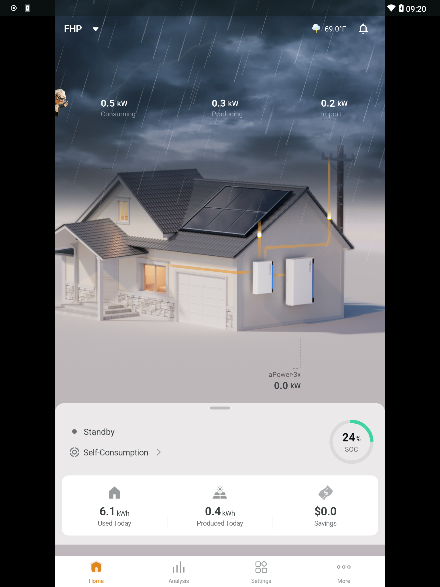
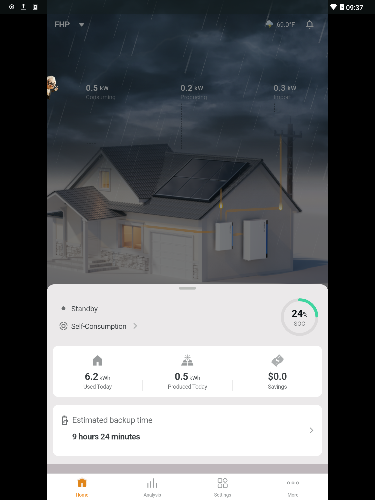
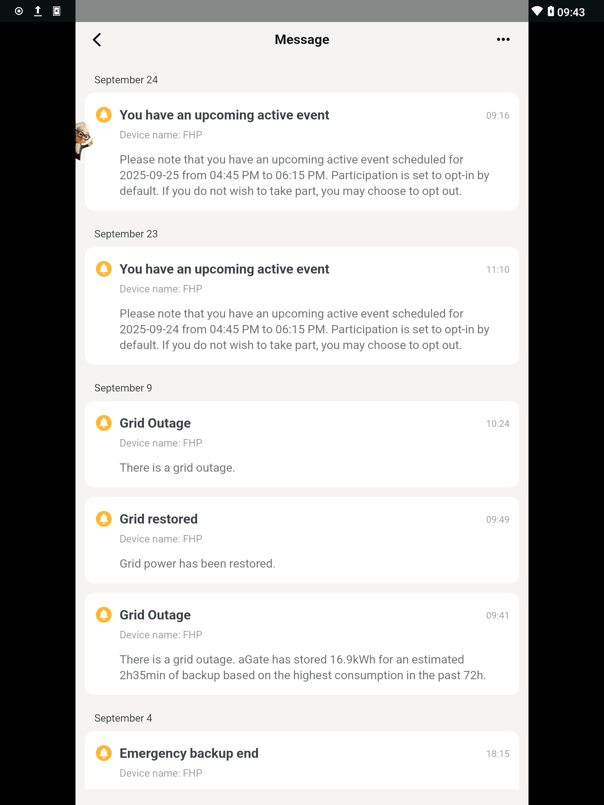
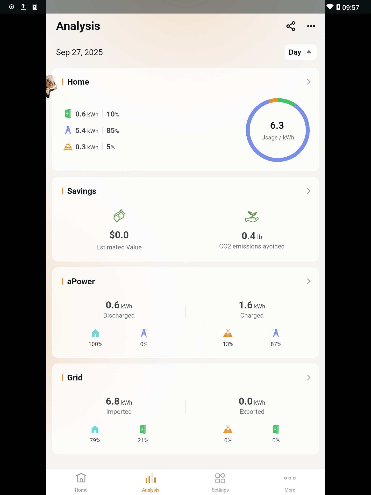
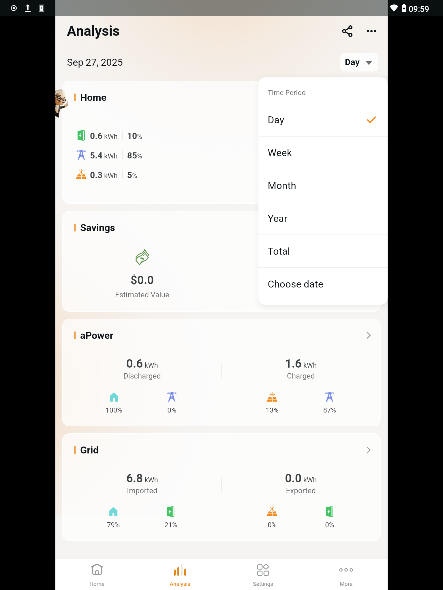
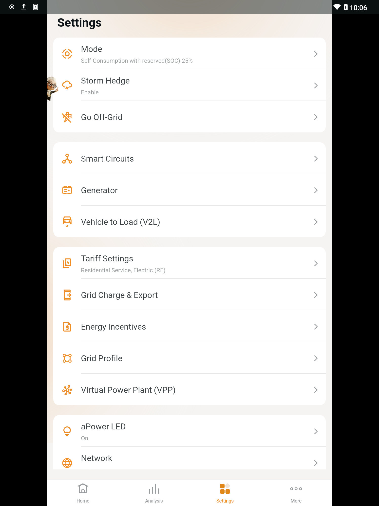
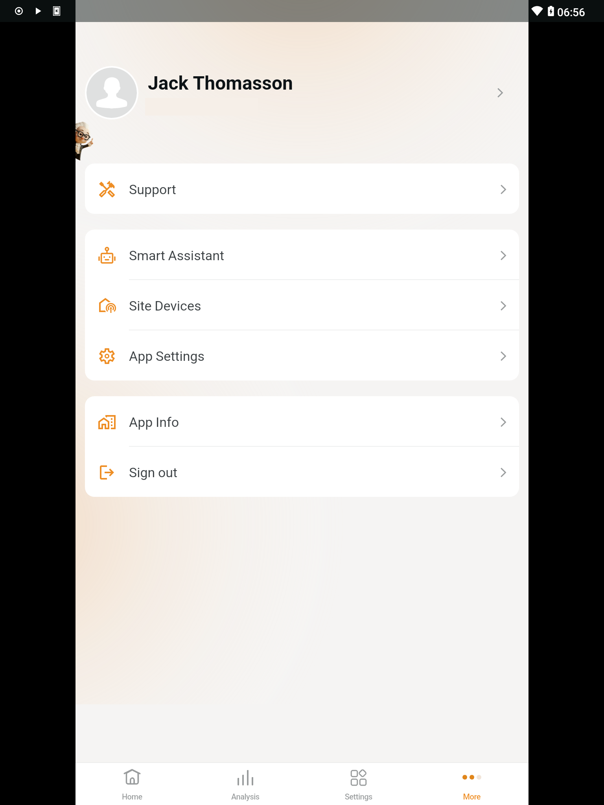

# Capture FranklinWH app functions

test every aspect of FranklinWH app that could be interesting to Home Assistant, starting with the more useful stuff.
capture and export with [HTTP Toolkit] for future reference and redo after upgrades.

consider an Android UI test framework for repetition and regression.
[Maestro](https://docs.maestro.dev) looks useful and simple.  consider test automation with **BOTH** FranklinWH and Home Assistant apps, _i.e._, ensure changes in HA reflect in FWH.

i do not have optional components like [Smart Circuits] or [Generator Module].

i do participate in _Virtual Power Plant_ ([VPP]) so capture an event sometime.

[HTTP Toolkit]: https://httptoolkit.com/
[Smart Circuits]: https://www.franklinwh.com/support/overview/smart-circuits/
[Generator Module]: https://www.franklinwh.com/support/overview/generator-module/
[VPP]: https://www.franklinwh.com/support/overview/virtual-power-plant/

## Screens

### Home

monitor the current state of [aGate] and [aPower] devices, weather and power distribution.

[aGate]: https://www.franklinwh.com/support/overview/components-of-franklin-home-power/#agate
[aPower]: https://www.franklinwh.com/support/overview/components-of-franklin-home-power/#apower-x

expand the tab at the bottom for _Estimated backup time_.

click the Bell icon for _Messages_.

### Analysis

show usage of the components over the time period selected by the chooser.

### Settings

configure the [aGate].  there are a lot of settings, figure out which are interesting to capture.

### More

these settings are probably less interesting to Home Assistant integration.
